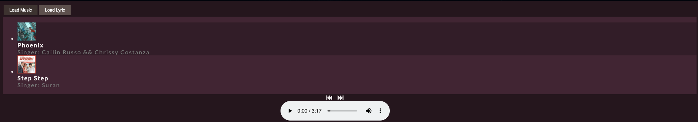

### `Functionalities`
Use ReactJS to build a basic music player with the following functionalities:
1) Load, play and pause music
2) Load Lyrics
3) Jump to the correct lyric line when clicking on the audio progress bar

### `Project Evidence`
https://drive.google.com/file/d/1N1RltaF34RlvsgDTJp_DD_vZ0_n92oHo/view

### `Todo`
1) Automatically scroll down lyrics when music playing
2) Enable to edit the lyrics
3) Jump to the position in the music when clicking on the lyrics